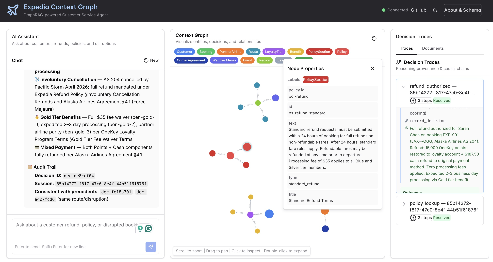

# Travel Context Graph

[](https://neo4j.com/cloud/aura/)
[](https://anthropic.com)
[](https://openai.com)


GraphRAG-powered customer service agent for flight disruptions, refunds, and policy resolution.

## Live Demo

**Frontend:** https://context-graph-travel.vercel.app  

---

## What This Demos

A live AI agent that handles travel customer service scenarios using a Neo4j knowledge graph. The key distinction from a standard RAG chatbot: every answer is grounded in **graph traversal** — the agent follows relationships across customers, bookings, carrier agreements, loyalty tiers, weather memos, and policy sections to reach decisions a text search would miss entirely.

**Four capabilities on display:**

- **GraphRAG** — hybrid vector + multi-hop graph retrieval across policy knowledge base
- **Context Graph** — live graph visualization updates as the agent works, showing exactly which nodes and relationships were used
- **Decision Audit Trail** — every agent decision is written to Neo4j as a `Decision` node with confidence score, risk factors, policy citations, and a 1536-dim embedding for precedent search
- **Agent Memory** — conversation context, extracted entities, and detected preferences persist in Neo4j across sessions

## Neo4j vs. Neptune

> *Neptune stores a graph. Neo4j is the intelligence layer — vector search, graph algorithms, and agent memory are native, not bolted on.*

| Capability | Neo4j | Neptune |
|------------|-------|---------|
| **Hybrid vector + graph search** | Native — [`db.index.vector.queryNodes()`](https://neo4j.com/docs/cypher-manual/current/indexes/semantic-indexes/vector-indexes/) runs in Cypher alongside traversal, one query, one connection | Requires Neptune ML via SageMaker — separate pipeline, separate orchestration |
| **Graph Data Science** (FastRP, Louvain, PageRank, shortest path) | Native [GDS library](https://neo4j.com/docs/graph-data-science/current/), runs on the same graph | No equivalent — data must be exported out |
| **Agent Memory as graph** | [NAMS](https://github.com/neo4j-labs/neo4j-agent-memory) writes `Session → Entity → Preference` nodes natively traversable alongside operational data | No equivalent — requires bolting on DynamoDB or a separate vector store |
| **Single graph principle** | Operational data, RAG knowledge base, agent memory, decision audit trail, and GDS embeddings — one graph, one language, one connection | Requires stitching multiple AWS services (Neptune + SageMaker + DynamoDB) to match the same capability set |
| **Cypher** | Expressive, readable, pattern-matching native | openCypher subset — no APOC, no GDS, no vector index procedures |

**The compounding advantage:** in this demo, the agent traverses 4–6 hops across customers, bookings, carrier agreements, loyalty tiers, weather waivers, and policy sections — then does a vector similarity search on the result — then writes a Decision node with policy citations — all in one graph, in one transaction, with one driver. On Neptune, each of those capabilities is a different service with a different API.

---

## Design Philosophy — Audit & Governance First

This project is built around a specific design principle: **every agent decision must be explainable, traceable, and grounded in policy**.

Unlike approaches that optimize for reasoning pattern discovery (structural similarity, causal chains, community detection), this model is built for **customer service compliance** — where the question isn't just "what did the agent decide?" but "which policy section justified it, under which carrier agreement, for which loyalty tier, given which active weather waiver?"

**How this shows up in the graph:**

- `Decision` nodes cite specific `PolicySection` nodes via `:BASED_ON` relationships — not free-text reasoning, but verifiable policy links
- Every decision is scoped to a `Session` — grouping the full conversation context with the outcome for audit replay
- The context graph in the UI is not decorative — it is the evidence trail, showing exactly which nodes the agent traversed to reach its answer
- Multi-hop traversal (4–6 hops) is what connects a customer's loyalty tier, their carrier's agreement, an active weather waiver, and the applicable refund policy — no single document contains all four; only the graph connects them

**The tradeoff:** this model trades decision similarity search and causal chain analysis (better suited for fraud or credit decisioning) for policy traceability and session-scoped audit trails — the right fit for regulated customer service workflows.

## Decision Audit Trail

Every agent response triggers a call to `record_decision`, which writes a `Decision` node to Neo4j with:

| Property | Description |
|----------|-------------|
| `decision_type` | `refund_authorized`, `fee_waived`, `denied`, `escalate`, `rebook`, `policy_lookup`, `analytics_query` |
| `value` | Full outcome text |
| `reasoning` | Agent's policy-grounded reasoning chain |
| `confidence_score` | 0.0–1.0 confidence (shown as a color-coded bar: green ≥85%, yellow ≥65%, red <65%) |
| `risk_factors` | List of risk signals the agent flagged (e.g. `mixed_payment_booking`, `weather_disruption`) |
| `policy_citations` | IDs of the `PolicySection` nodes cited |
| `embedding` | 1536-dim OpenAI embedding of `decision_type + outcome + reasoning` — enables `find_precedents()` vector search |
| `made_at` | Timestamp |

**UI panels:**
- **Session tab** — shows the decision recorded for the *current* question: outcome, confidence bar, risk factor badges, and policy citations — alongside the ReAct traces
- **All Decisions tab** — full historical audit log of every decision ever recorded, expandable with full reasoning

**Seeding sample decisions:**
```bash
.venv/bin/python3 data/seed_decisions.py
```
Creates 8 realistic decisions (refunds, fee waivers, escalations, rebooks) with embeddings so `find_precedents()` works out of the box.

## Graph Data Model

```
(:Customer)-[:HAS_TIER]->(:LoyaltyTier)-[:GRANTS]->(:Benefit)
(:Customer)-[:MADE]->(:Booking)-[:OPERATED_BY]->(:PartnerAirline)
(:Booking)-[:ON_ROUTE]->(:Route)<-[:COVERS]-(:Region)<-[:ACTIVE_FOR]-(:WeatherMemo)
(:Booking)-[:GOVERNED_BY]->(:CarrierAgreement)-[:APPLIES_TO]->(:PartnerAirline)
(:Booking)-[:DISRUPTED_BY]->(:Event)
(:Policy)-[:HAS_SECTION]->(:PolicySection)-[:REFERENCED_BY]->(:PolicySection)
(:Session)-[:MADE_DECISION]->(:Decision)-[:BASED_ON]->(:PolicySection)
(:Session)-[:FOR_CUSTOMER]->(:Customer)
```

## Demo Scenarios



### Disruption & Refunds
- Process a refund for Sarah Chen on booking EXP-991 — her Maui flight was canceled due to the Pacific storm
- What refund is James Okafor entitled to for his disrupted booking EXP-887?

### Multi-hop GraphRAG
These questions require 4–6 hops across the graph. Naive text search returns partial answers; the graph connects them correctly.

- Which customers affected by the Pacific storm qualify for the automatic $50 Platinum goodwill credit?
- Tom Reyes wants to cancel his ORD→Miami booking — what cancellation fees apply given his Blue tier and no active weather waiver on that route?
- What is the fastest possible refund timeline for Sarah Chen on EXP-991, combining her Gold status, the Alaska Airlines agreement, and the active Pacific storm waiver?
- If Maya Patel's ORD→Miami flight gets disrupted, is there any active weather waiver covering her route, and what would her Silver tier entitle her to?

### Policy Lookup
- Is there an active weather waiver affecting Alaska Airlines flights to Hawaii?
- What is the refund policy for involuntary cancellations?
- What fee waivers apply to Gold loyalty members?
- What are the refund terms under the Alaska Airlines carrier agreement?

### Customer Intelligence
- Show me all Gold and Platinum customers with their disrupted bookings
- Which customers have points+cash mixed payment bookings affected by the Pacific storm?
- What past refund decisions have been recorded for storm cancellations?

## Quick Start

```bash
# 1. Copy and fill in credentials
cp .env.example .env

# 2. Install dependencies
make install

# 3. Seed the graph (requires Neo4j AuraDB or local Neo4j)
make seed

# 4. Start backend + frontend
make start
```

- **Frontend:** http://localhost:3000
- **Backend API:** http://localhost:8000
- **Neo4j Browser:** http://localhost:7474 *(local only)*

## Architecture

```
/
├── backend/              FastAPI + Anthropic Tools agentic loop
│   ├── app/
│   │   ├── agent.py      Tool definitions + agentic loop
│   │   ├── config.py     Settings (pydantic-settings + .env)
│   │   ├── context_graph_client.py  Neo4j driver + SSE collector
│   │   ├── memory.py     Agent memory (disabled by default; set MEMORY_BACKEND=bolt to enable)
│   │   └── routes.py     API endpoints — SSE streaming chat, /traces, /decisions (with ?session_id filter), graph queries
│   └── scripts/
│       └── generate_data.py
├── frontend/             Next.js 15 + Chakra UI v3 + Neo4j NVL
│   ├── app/page.tsx      3-panel layout (Chat / Graph / Traces)
│   └── components/
│       ├── ChatInterface.tsx        SSE streaming chat + suggested questions
│       ├── ContextGraphView.tsx     Live graph (NVL)
│       ├── DecisionTracePanel.tsx   Session tab (current decision + ReAct traces) + All Decisions audit log
│       ├── DocumentBrowser.tsx      Policy document browser
│       └── SchemaDrawer.tsx         About panel, data model, demo scenarios
├── rag/
│   ├── graphrag.py       Hybrid vector + graph retrieval (OpenAI text-embedding-3-small)
│   └── reembed.py        One-time migration: drops old 384-dim indexes, re-embeds at 1536 dims
├── cypher/
│   └── schema.cypher     Neo4j constraints, range indexes, and vector indexes (policy, carrier, weather, decision)
├── data/
│   ├── seed.py           Sample data generator (customers, bookings, policies, routes)
│   └── seed_decisions.py Seeds 8 realistic Decision nodes with 1536-dim embeddings for precedent search
├── .env.example          Configuration template
└── Makefile              Dev commands
```

## Agent Tools

| Tool | Description |
|------|-------------|
| `get_customer` | Customer profile, loyalty tier, and benefits |
| `get_booking` | Booking details — carrier, route, payment, disruption |
| `search_policies` | GraphRAG hybrid search across policy KB + carrier agreements + weather memos |
| `get_active_weather` | Weather memos affecting a booking's route (Booking → Route → Region → WeatherMemo) |
| `find_weather_waivers` | Active waivers by airline or destination — no booking required |
| `record_decision` | Write a `Decision` node with `confidence_score`, `risk_factors`, policy citations, and a 1536-dim embedding — mandatory on every request |
| `find_precedents` | Vector similarity search over past `Decision` embeddings to surface structurally similar prior cases |
| `issue_refund` | Mock refund action (demo) |
| `execute_cypher` | Read-only Cypher escape hatch |
| `get_schema` | Graph schema lookup |

## Environment Variables

```bash
cp .env.example .env
```

| Variable | Description |
|----------|-------------|
| `NEO4J_URI` | Neo4j connection URI (Aura: `neo4j+s://` or local: `bolt://`) |
| `NEO4J_USERNAME` | Neo4j username |
| `NEO4J_PASSWORD` | Neo4j password |
| `ANTHROPIC_API_KEY` | Claude API key |
| `OPENAI_API_KEY` | OpenAI API key — used for `text-embedding-3-small` (1536-dim) vector search |
| `MEMORY_BACKEND` | `disabled` (default, no extra deps) or `bolt` (self-hosted Neo4j memory) |
| `DOMAIN_ID` | Domain identifier — set to `travel-customer-service` |
| `BACKEND_PORT` | Default: 8000 |
| `FRONTEND_PORT` | Default: 3000 |

## Roadmap

### Immediate

**Re-enable Cross-Session Agent Memory (NAMS + OpenAI embeddings)**
The memory infrastructure is already wired — entities and preferences are extracted per message but discarded at session end. Re-enabling requires:
- Swap `neo4j-agent-memory[litellm,extraction]` back into `pyproject.toml` (no `sentence-transformers` — use OpenAI via LiteLLM instead)
- Configure `memory.py` to initialize with `text-embedding-3-small` through LiteLLM
- Set `MEMORY_BACKEND=bolt` in Railway environment variables

Result: the agent remembers customer context across sessions — prior interactions, stated preferences, and past decisions — all persisted as a subgraph in Neo4j and traversable alongside the live query.

---

### Agent Memory — Graph-native Persistence
The agent already extracts entities and preferences per conversation. Next step is making this **visible and queryable** as a first-class graph feature:
- Dedicated **Memory panel** in the UI showing what the agent has learned about each customer across sessions — past interactions, stated preferences, inferred travel patterns
- `CustomerMemory` nodes linked to `Customer` via `REMEMBERS` relationships, surfaced in the context graph alongside the live query
- Preference drift tracking — graph edges showing when a preference changed and why

### Precedent Nodes — Decision Provenance as a Graph
Currently decisions are written as `Decision` nodes with policy citations. The roadmap extends this to a full provenance graph:
- `Precedent` nodes linking similar past decisions — "this refund was approved because a structurally identical case was approved in March"
- `(:Decision)-[:CITES_PRECEDENT]->(:Decision)` edges created automatically when the agent finds a matching prior case
- `find_precedents` tool upgraded from keyword search to graph traversal over the precedent chain
- UI: precedent chain visible in the Traces panel, decision audit trail navigable hop-by-hop

### RAG vs GraphRAG Comparison
Side-by-side view showing for each tool call:
- What **vector search alone** would have returned
- What **graph traversal added** on top
- Which nodes in the graph are vector matches vs. graph-expanded — color-coded in the visualization

### Structural Similarity via FastRP
Complement text embeddings with **FastRP graph embeddings** (structural similarity across the knowledge graph). Use case: find past cases that are structurally identical even when the text is different — e.g. a weather disruption on United looks the same structurally as one on Alaska, so the agent can apply the same policy path.

### Graph Data Science — Impact Analysis
- **Community detection** (Louvain) to find clusters of related disruption events and affected customers
- **PageRank** on policy sections to surface the most-cited rules
- **Shortest path** between a customer and a weather memo to explain the disruption chain in plain language

---

## Changelog

### v0.3 — 2026-05-24 — Decision Audit Trail

**New features**
- `record_decision` tool now writes `confidence_score` (0–1), `risk_factors` (list), and a 1536-dim OpenAI embedding to every `Decision` node — mandatory on every agent request
- `find_precedents` upgraded to vector similarity search over `decision_embeddings` index, with recency fallback
- New `/decisions` API endpoint with optional `?session_id` filter
- **All Decisions tab** in the right panel — expandable cards showing outcome, full reasoning, confidence bar, risk factor badges, and policy citations for every recorded decision
- **Session tab** now surfaces a "Decision Recorded" card for the current question — no tab switching required
- `data/seed_decisions.py` — seeds 8 realistic decisions (refunds, fee waivers, escalations, rebooks) with embeddings
- `cypher/schema.cypher` updated: `decision_embeddings` vector index, `decision_type` and `decision_made_at` range indexes, `(:Session)-[:FOR_CUSTOMER]->(:Customer)` relationship

**UI polish**
- Chat panel 480 px, Traces panel 300 px, container `maxW="100%"`
- Panel headers `bg="gray.100"`, input field `bg="gray.100"` (gray, not blue)
- Question input field styled gray; suggested questions scroll panel above input
- "Why Graph?" section added to SchemaDrawer

**Bug fixes**
- Neo4j `DateTime` objects serialized via `toString()` in Cypher — prevents FastAPI 500 on agent-created decisions
- `[x IN collect(...) WHERE x.id IS NOT NULL]` filter removes ghost `{id:null}` entries in `cited_sections`
- Removed `overflow="hidden"` from card boxes — WebKit/Safari clips dynamically added children in flex column layout
- `scrollIntoView` on card expand — content always jumps into view
- `made_at` display guard for dict-serialized DateTime values

---

### v0.2 — 2026-05-23 — Travel Rebrand + Layout Redesign

**Embeddings**
- Switched from `sentence-transformers/all-MiniLM-L6-v2` (384-dim, local) to OpenAI `text-embedding-3-small` (1536-dim) for all vector indexes — policy sections, carrier agreements, weather memos
- `rag/reembed.py` one-time migration to drop old 384-dim indexes and re-embed at 1536 dims

**UI**
- Full 3-panel layout redesign: Chat (left) / Context Graph (center) / Decision Traces (right)
- Dark header (`gray.800`) with Plane icon, blue title, gray tagline
- Context Graph panel header: "Context Graph — Visualize entities, decisions, and relationships" (static)
- Suggested questions scrollable panel above chat input
- Empty chat state: centered Plane icon + "How can I help you today?"
- "Why Graph?" section added to SchemaDrawer with three principles

**Deployment**
- `MEMORY_BACKEND=disabled` default — skips `sentence-transformers` and NAMS on Railway cold starts
- SSE keepalive pings every 5 s — prevents Railway/Cloudflare proxy timeouts
- Railway health check, port binding, and Dockerfile build context fixes
- `DOMAIN_ID=travel-customer-service` replaces `expedia-customer-service`

---

### v0.1 — 2026-05-22 — Initial Release

- FastAPI backend with Anthropic Tools agentic loop (ReAct: think → tool → observe)
- Next.js 15 + Chakra UI v3 frontend, Neo4j NVL graph visualization
- Neo4j AuraDB — graph data model: Customer, Booking, PartnerAirline, Route, Region, WeatherMemo, Policy, PolicySection, CarrierAgreement, LoyaltyTier, Benefit, Session, Decision
- GraphRAG hybrid retrieval — vector similarity + multi-hop Cypher traversal (4–6 hops) in one query
- Agent tools: `get_customer`, `get_booking`, `search_policies`, `get_active_weather`, `find_weather_waivers`, `record_decision`, `find_precedents`, `issue_refund`, `execute_cypher`, `get_schema`
- NAMS agent memory infrastructure wired (disabled by default)
- Live graph visualization — context graph updates in real time as the agent traverses nodes
- Deployed: Vercel (frontend) + Railway (backend)

---

## Troubleshooting

**Backend can't connect to Neo4j**
- Verify `NEO4J_URI`, `NEO4J_USERNAME`, `NEO4J_PASSWORD` in `.env`
- For AuraDB use `neo4j+s://` URI scheme
- Run `make test-connection` to validate

**GraphRAG policy search fails**
- Requires `OPENAI_API_KEY` — embeddings are generated via `text-embedding-3-small` at query time
- The `rag/graphrag.py` retriever uses a synchronous Neo4j driver — credentials are patched at call time from `settings`
- If you get index dimension errors, run `python rag/reembed.py` to drop old 384-dim indexes and re-embed all nodes at 1536 dims

**Agent memory not persisting**
- Default `MEMORY_BACKEND=disabled` skips Neo4j memory entirely — this is intentional for Railway deployments
- Set `MEMORY_BACKEND=bolt` and provide a Neo4j URI/credentials to enable cross-session memory

**Port conflict**
- Change `BACKEND_PORT` or `FRONTEND_PORT` in `.env`
- Kill existing: `lsof -ti:8000 | xargs kill`

**Frontend build errors**
- Requires Node.js 18+
- Delete `node_modules/` and rerun `npm install`
